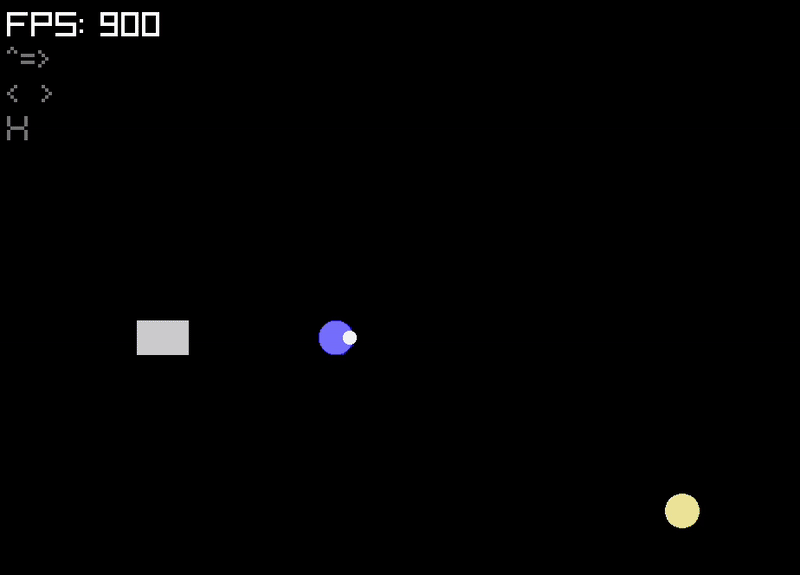

# Jetman

A tiny ship navigation the vast of space.

<figure>

    <figcaption>The Jet Pod tows an item</figcaption>
</figure>

## Run Jetman

[Install the Rust tools](https://www.rust-lang.org/tools/install):

``` sh
curl --proto '=https' --tlsv1.2 -sSf https://sh.rustup.rs | sh
```

Compile and run from within the project root directory:

``` sh
cargo run
```
